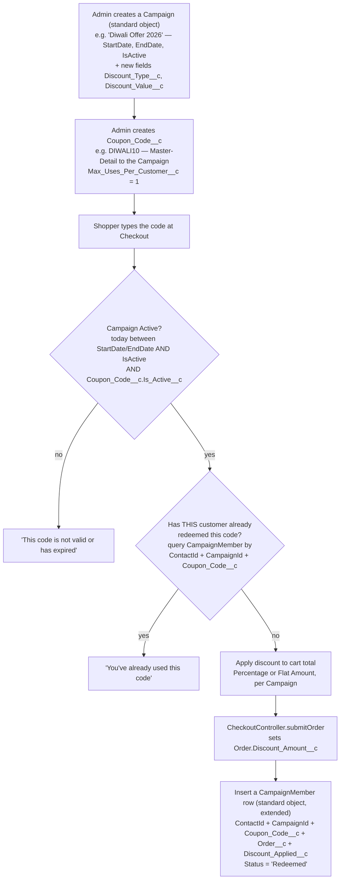
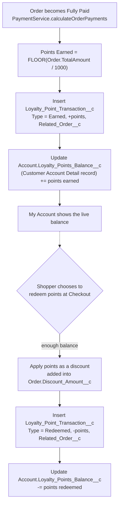
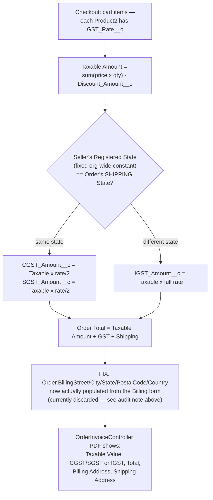
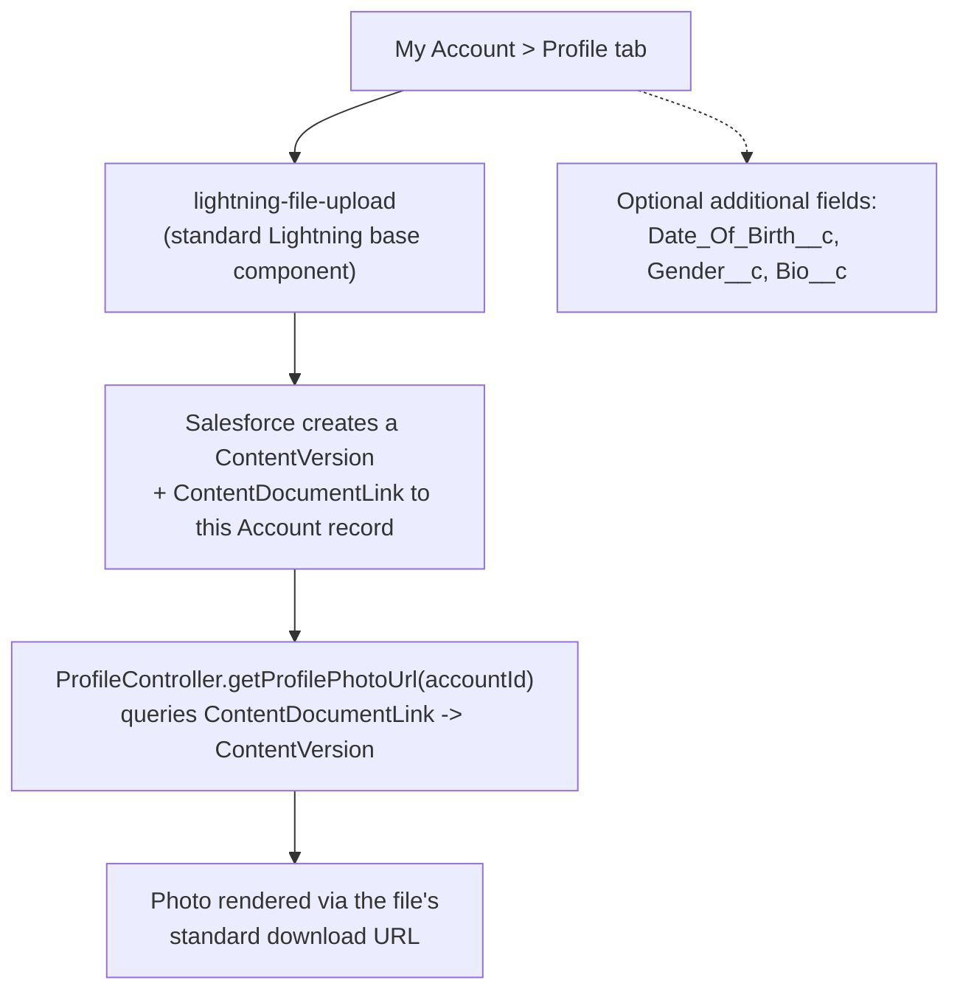
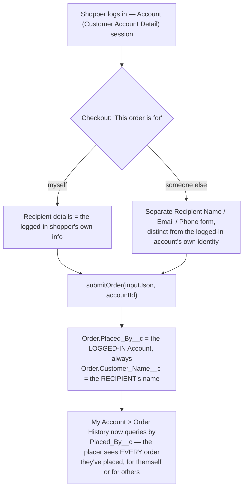
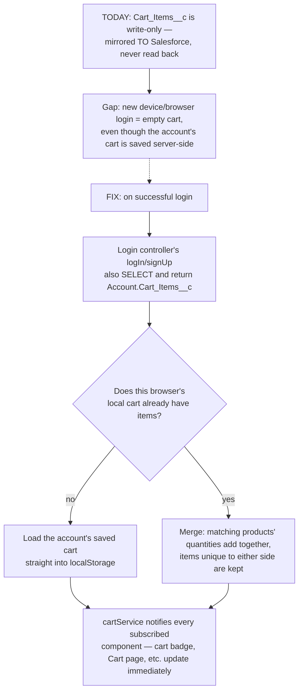

# LaptopKart — Feature Expansion Plan

**Status: plan only — nothing in this document has been built yet.**

Six requested additions, researched against the real, current codebase (not guessed) so every flow below reflects how the app actually works today, and every new object/field is grounded in what's genuinely missing. Where the current code was audited and found to have a real gap (billing address, cart restore), that's called out explicitly as its own finding, not just folded silently into the new design.

---

## 1. Discount Campaigns & Coupon Codes

### The core idea
Standard **`Campaign`** (yes — the same object Salesforce ships for marketing) stands in for "Diwali Offer 2026" — `Name`, `StartDate`, `EndDate`, `IsActive`, `Description` all map directly, and its `Status` picklist can just be re-valued to Draft/Active/Expired/Cancelled instead of adding a new field. Only two attributes have no standard equivalent (`Discount_Type__c`, `Discount_Value__c`), added as new fields onto Campaign. A **coupon code** (e.g. `DIWALI10`, still a genuinely new object — no standard equivalent exists) is a Master-Detail child of that Campaign. Every redemption is logged as its own row, but — standard-object-first here too — that row lives on standard **`CampaignMember`** rather than a new custom object: every checkout already produces a real `Contact` (via `Database.convertLead`), and `CampaignMember` already exists purely to link a `Contact` to a `Campaign`, with a `Status` field ready to mean "Redeemed." Three small custom fields extend it with what it doesn't have out of the box. "One code, one time per user" is enforced by checking that ledger, not by a flag that can only mean "used" or "not used" globally.

**Assumption made explicit:** "one code is valid only one time for the users" is read here as *per customer* — `DIWALI10` can be used once by every customer, not once total across the whole store. If you actually meant a single global use (first customer only), that's a one-line change to the validation query in Build Order step 4 below.

### Flow

### Object reference

#### `Campaign` — standard object, extended
| Field (API Name) | Label | Type | Notes |
|---|---|---|---|
| `Name` | Campaign Name | *(standard, reused)* | e.g. "Diwali Offer 2026" |
| `StartDate` / `EndDate` | Start/End Date | *(standard, reused)* | Campaign's usable window |
| `IsActive` | Active | *(standard, reused)* | On/off switch |
| `Status` | Status | *(standard picklist, re-valued)* | Replace default values (Planned, In Progress...) with Draft, Active, Expired, Cancelled |
| `Description` | Description | *(standard, reused)* | Internal note about what the campaign is |
| `Discount_Type__c` | Discount Type | Picklist — **new field** | Percentage, Flat Amount — restricted, required |
| `Discount_Value__c` | Discount Value | Number(18,2) — **new field** | e.g. `10` for 10%, or `500` for a flat ₹500 off |

#### `Coupon_Code__c` — new object, child of Campaign
| Field (API Name) | Label | Type | Notes |
|---|---|---|---|
| `Code__c` | Code | Text(30), Unique | e.g. `DIWALI10` — what the shopper types |
| `Campaign__c` | Campaign | Master-Detail(**Campaign**, standard) | Deleted along with its campaign |
| `Is_Active__c` | Active | Checkbox | Lets admin disable one code without touching the campaign |
| `Max_Uses_Per_Customer__c` | Max Uses Per Customer | Number(18,0) | Default `1` — this is what "one time per user" enforces |
| `Max_Total_Uses__c` | Max Total Uses | Number(18,0) | Optional org-wide cap; blank = unlimited |
| `Total_Redemptions__c` | Total Redemptions | Roll-Up Summary (COUNT) | Counts child `CampaignMember` rows where `Coupon_Code__c` is this record |

#### `CampaignMember` — standard object, extended (the audit ledger)
| Field (API Name) | Label | Type | Notes |
|---|---|---|---|
| `ContactId` | Contact | *(standard, reused)* | Required by the object — who redeemed it (every checkout already produces a real Contact) |
| `CampaignId` | Campaign | *(standard, reused)* | Required by the object |
| `Status` | Status | *(standard picklist, re-valued)* | Add/use a "Redeemed" value |
| `Coupon_Code__c` | Coupon Code | Lookup(Coupon_Code__c) — **new field** | Which specific code was used |
| `Order__c` | Order | Lookup(Order) — **new field** | Which order it was applied to |
| `Discount_Applied__c` | Discount Applied | Currency(16,2) — **new field** | The actual ₹ amount this redemption knocked off |

#### `Order` — new field
| Field (API Name) | Label | Type | Notes |
|---|---|---|---|
| `Discount_Amount__c` | Discount Amount | Currency(16,2) | Total discount applied to this order (coupon and/or loyalty points, see §2) |

### Build order
1. **`Campaign`** *(schema)* — add `Discount_Type__c` + `Discount_Value__c`; re-value the standard `Status` picklist.
2. **`Coupon_Code__c`** *(schema)* — 6 fields above, the one genuinely new object here.
3. **`CampaignMember`** *(schema)* — add `Coupon_Code__c`, `Order__c`, `Discount_Applied__c`; re-value `Status` to include "Redeemed."
4. **`Order.Discount_Amount__c`** *(schema)*.
5. **`DiscountService.cls`** *(logic)* — one method to validate a code (active, in-date, not already redeemed by this customer via a `CampaignMember` query, under any total cap) and compute the discount amount; called from `CheckoutController.submitOrder` before the Payment__c amount is finalized.
6. **LWC** *(logic)* — a "Have a coupon code?" input on Cart or Checkout, calling an `@AuraEnabled` validate-only method for instant feedback, then passing the validated code through to `submitOrder`.

### Decisions only you can make
- **Stacking:** can a coupon and loyalty points (§2) be used on the same order, or is it one or the other?
- **Scope:** should a campaign ever apply automatically to certain categories/products only, or is every coupon store-wide?

---

## 2. Loyalty Points

### The core idea
One live number per customer and one ledger (`Loyalty_Point_Transaction__c`) that logs every earn and redeem — same pattern as §1's coupon ledger, and the same pattern `Stock_Quantity__c`/`Stock_Movement__c` used in the earlier Inventory plan. Per the Account consolidation decision (storefront login/signup now lives on standard `Account`, under a "Customer Account Detail" record type, instead of the custom `Login_Credentials__c` object), the live balance is a new field directly on `Account`. No standard object covers a points ledger, so `Loyalty_Point_Transaction__c` stays a genuinely new custom object.

**Assumption made explicit:** "1 point when order someone" is read as **1 point per ₹1,000 spent** (per your wording "per thousand"), earned once the order is actually **Fully Paid** — not at the moment of placing the order — since Cash on Delivery orders shouldn't earn points before the cash is actually collected. Redemption value (how much ₹1 of discount 1 point is worth) is listed as an open decision below.

### Flow

### Object reference

#### `Account` — new field (Customer Account Detail record type)
| Field (API Name) | Label | Type | Notes |
|---|---|---|---|
| `Loyalty_Points_Balance__c` | Loyalty Points Balance | Number(18,0) | Default `0` — the live, current balance |

#### `Loyalty_Point_Transaction__c` — new object, the ledger
| Field (API Name) | Label | Type | Notes |
|---|---|---|---|
| `Customer__c` | Customer | Lookup(Account) | Required — the Customer Account Detail record |
| `Points__c` | Points | Number(18,0) | Signed — negative for Redeemed |
| `Type__c` | Type | Picklist | Earned, Redeemed, Expired, Adjustment — restricted |
| `Related_Order__c` | Related Order | Lookup(Order) | Set for Earned/Redeemed rows |
| `Transaction_Date__c` | Transaction Date | Date/Time | Defaults to now |
| `Notes__c` | Notes | Text(255) | e.g. reason for a manual Adjustment |

### Build order
1. **`Account.Loyalty_Points_Balance__c`** *(schema)*.
2. **`Loyalty_Point_Transaction__c`** *(schema)* — 6 fields above.
3. **`LoyaltyService.cls`** *(logic)* — `awardPoints(orderId)` called from `PaymentService.calculateOrderPayments` at the exact moment an Order rolls up to Fully Paid; `redeemPoints(accountId, points)` called from checkout, validated against the live balance before the discount is applied.
4. **My Account (LWC)** *(logic)* — show the balance on the Profile/Dashboard tab (the login controller already returns the session — add the balance to that response), plus a small transaction history list reading `Loyalty_Point_Transaction__c`.
5. **Checkout/Payment (LWC)** *(logic)* — a "Use N points (₹X off)" toggle, same place the coupon input from §1 lives.

### Decisions only you can make
- **Redemption rate:** how much is 1 point worth when spent? (e.g. 1 point = ₹1 is the simplest to reason about; 1 point = ₹0.50 stretches the balance further.)
- **Expiry:** do points ever expire, or do they last forever? (The `Expired` picklist value above is ready either way — it's just unused until you decide.)
- **Minimum redemption:** can a shopper redeem 1 point, or only in blocks (e.g. minimum 100)?

---

## 3. GST / Tax System, and Fixing Billing vs Shipping Address

### What the audit found (not a design choice — a real gap)
`CheckoutController.CheckoutInput` has **no billing-address fields at all** — only `shippingStreet/City/State/PostalCode/Country`. The Billing Address *form* already exists in the UI (`techBasketBillingForm`) and the shopper's input is held in `techBasketCheckout`'s draft — but `techBasketPayment.js`'s `completeOrder()` builds the Apex payload from `this.draft.shippingAddress` only; `this.draft.billingAddress` is read nowhere. It reaches Salesforce's standard `Order.Billing*` fields never — they exist on the object (used by GST invoicing below) but are simply never set. This has to be fixed as part of this feature, not worked around, since a GST invoice legally needs a real billing address.

### The core idea
India's GST is **place-of-supply** based for physical goods: the split between CGST+SGST (intrastate) vs IGST (interstate) is decided by comparing the **seller's registered state** to the **shipping (delivery) state** — not the billing state. Billing address is what's printed on the invoice as who is being billed; it can legitimately differ from where the goods are shipped, and doesn't change the tax split. Each product carries its own GST rate (laptops in India are typically the 18% slab, but this varies by HSN code, so it's a per-product field, not a store-wide constant).

### Flow

### Object reference

#### `Product2` — new fields
| Field (API Name) | Label | Type | Notes |
|---|---|---|---|
| `GST_Rate__c` | GST Rate (%) | Percent(5,2) | e.g. `18.00` |
| `HSN_Code__c` | HSN Code | Text(10) | Optional — needed on a fully compliant GST invoice |

#### `Order` — new fields
| Field (API Name) | Label | Type | Notes |
|---|---|---|---|
| `Taxable_Amount__c` | Taxable Amount | Currency(16,2) | Subtotal minus `Discount_Amount__c`, before tax |
| `CGST_Amount__c` | CGST Amount | Currency(16,2) | Set only when intrastate |
| `SGST_Amount__c` | SGST Amount | Currency(16,2) | Set only when intrastate |
| `IGST_Amount__c` | IGST Amount | Currency(16,2) | Set only when interstate |
| *(no new field)* | Billing Address | *(standard, already exists)* | `BillingStreet/City/State/PostalCode/Country` — just needs to actually be populated (the fix above) |

### Build order
1. **Fix billing address pass-through first** *(logic)* — add `billingStreet/City/State/PostalCode/Country` to `CheckoutInput`, have `techBasketPayment.js` include `this.draft.billingAddress` (falling back to the shipping address if "same as shipping" was checked) in the payload, and set `Order.Billing*` in `submitOrder` STEP 7 alongside the existing `Shipping*` assignment. This alone is worth doing even before GST — it's a real, separate bug.
2. **`Product2.GST_Rate__c` + `HSN_Code__c`** *(schema)*.
3. **`Order.Taxable_Amount__c` / `CGST_Amount__c` / `SGST_Amount__c` / `IGST_Amount__c`** *(schema)*.
4. **`TaxService.cls`** *(logic)* — given the cart lines and the shipping state, computes taxable amount and the CGST/SGST vs IGST split; called from `submitOrder` right where `Order.TotalAmount` is currently derived from OpportunityLineItems.
5. **Order Summary / Payment (LWC)** *(logic)* — show the tax breakdown in the cart/checkout totals panel, not just a single "tax" line, so the shopper sees CGST + SGST (or IGST) itemized the way Indian e-commerce invoices normally show it.
6. **`OrderInvoiceController` / invoice PDF** *(logic)* — add the tax breakdown and the now-real billing address to the printed invoice.

### Decisions only you can make
- **Seller's registered state:** what is it? (Needed as a fixed constant `TaxService` compares against — a Custom Setting or Custom Metadata Type record is the right place for it, so it's editable without a deploy.)
- **Tax-inclusive or tax-exclusive product prices:** do the prices already shown on the storefront include GST (common in Indian B2C), or is GST added on top at checkout? This changes whether `TaxService` extracts tax from the existing price or adds it.

---

## 4. Profile Page Improvements

### The core idea
The specific example given — a profile photo — doesn't need a new custom object or even a new field: Salesforce Files (`ContentVersion` + `ContentDocumentLink`) is the standard mechanism, and `lightning-file-upload` is a ready-made base component for it. Other profile fields (date of birth, gender, a short bio) are plain new fields on standard `Account` (Customer Account Detail record type, per the Account consolidation decision) if you want them — listed as optional, since only the photo was given as a concrete example.

### Flow

### Object reference

#### `Account` — optional new fields (Customer Account Detail record type, only if you want them beyond the photo)
| Field (API Name) | Label | Type | Notes |
|---|---|---|---|
| `Date_Of_Birth__c` | Date of Birth | Date | Optional |
| `Gender__c` | Gender | Picklist | Male, Female, Other, Prefer not to say — optional |
| `Bio__c` | Bio | Text Area(255) | Optional short "about me" |

No new object or field is needed for the photo itself — it's stored as a standard Salesforce File, linked to the customer's Account record.

### Build order
1. **`ProfileController.cls`** *(logic)* — `getProfilePhotoUrl(accountId)` (query `ContentDocumentLink` where `LinkedEntityId = :accountId`, most recent `ContentVersion`); this needs `AccessLevel.SYSTEM_MODE` like the rest of the Guest-context Apex in this app.
2. **My Account Profile tab (LWC)** *(logic)* — add `lightning-file-upload` scoped to the logged-in shopper's Account record id, and render the photo via the Apex method above.
3. **Optional fields** *(schema, only if wanted)* — the 3 fields above, plus corresponding form inputs on the Profile tab.

### Decisions only you can make
- Beyond a photo, which of the optional fields (DOB, gender, bio) do you actually want — or is the photo the whole ask?
- Any file-size/type restriction on the photo upload (`lightning-file-upload` supports an `accept` attribute, e.g. images only)?

---

## 5. Ordering On Behalf Of Someone Else, and "Show All My Orders"

### What the audit found
There is currently **no link between an Order and the shopper's login identity at all** — `submitOrder` doesn't even receive a login/session id as a parameter. The only tie between a shopper's login identity and "their" orders is `getOrdersByEmail(email)`, which matches by the email typed at checkout. That means today, if a logged-in shopper ever placed an order using a *different* email (say, shipping it to someone else), that order would **not** show up in their own Order History — there's no record of who actually placed it, only who it's addressed to.

### The core idea
**Assumption made explicit** (the original wording was ambiguous, so this is a specific, concrete design for you to confirm or correct): add a **`Placed_By__c`** lookup on `Order` that always stores the actual logged-in **`Account`** (Customer Account Detail record, per the Account consolidation decision) that submitted the order — separate from `Customer_Name__c` and the shipping fields, which describe who the order is *for*/where it ships. "Show all the orders" is read as: My Account's Order History should list every order a shopper has ever **placed**, regardless of who it was for, which it can't do today.

### Flow

### Object reference

#### `Order` — new field
| Field (API Name) | Label | Type | Notes |
|---|---|---|---|
| `Placed_By__c` | Placed By | Lookup(Account) | The logged-in Account (Customer Account Detail) that actually submitted the order — never changes based on who it's for. Distinct from the standard `AccountId` field, which represents who the order is *for*. |

### Build order
1. **`Order.Placed_By__c`** *(schema)*.
2. **`CheckoutController.submitOrder`** *(logic)* — add an `accountId` field to `CheckoutInput` (sent from the LWC, which already has it via the logged-in session), and set `orderUpdate.Placed_By__c` in STEP 7 alongside the other Order fields.
3. **`CheckoutController.getOrdersByAccountId(accountId)`** *(logic)* — new `@AuraEnabled` method querying `Order WHERE Placed_By__c = :accountId`, alongside (not replacing) the existing `getOrdersByEmail`.
4. **Checkout (LWC)** *(logic)* — a "For myself / For someone else" toggle; when "someone else" is chosen, show a second, separate name/email/phone block that becomes the shipping/recipient identity, while the logged-in shopper's own Account id still rides along as `Placed_By__c`.
5. **My Account > Order History (LWC)** *(logic)* — switch (or add to) the order lookup to use `getOrdersByAccountId` so every order the shopper placed shows up, not just ones matching their own email.

### Decisions only you can make
- Should an order placed *for* someone else also be visible to that recipient (if they separately have their own Customer Account Detail record under that email), or only to whoever placed it?
- Any limit on how many "for someone else" orders one account can place (abuse/fraud consideration), or is this fully open?

---

## 6. Cart System — Audit Findings & Fix Plan

### What the audit found (this is a bug fix, not a new feature)
`Cart_Items__c` (moving to `Account` under the Account consolidation decision) is **write-only**. `cartService.js` writes to it via `updateCartSnapshot` on every cart change and the instant a login session starts — but nothing anywhere in the codebase ever reads it back. Confirmed directly: `cartService.js`'s `getCart()` reads exclusively from `window.localStorage`; the login controller's `logIn`/`signUp` don't even `SELECT Cart_Items__c` in their queries; `techBasketMyAccount.js`'s login handler doesn't import `cartService` at all. The practical effect: **logging into the same account on a new device or a cleared browser always starts with an empty cart**, even though Salesforce has been faithfully mirroring the cart the whole time — it's being written and simply never read.

### The fix

### Object reference
No schema change needed — `Cart_Items__c` already exists (on `Account` per the consolidation decision) and is already being written correctly. This is purely an Apex + LWC fix.

### Build order
1. **Login controller's `logIn` / `signUp`** *(logic)* — add `Cart_Items__c` to the existing SOQL against `Account`, and add a `cartSnapshot` field to the session return type carrying that JSON string.
2. **`cartService.js`** *(logic)* — new exported function, e.g. `restoreOrMergeCart(cartSnapshotJson)`, implementing the merge-vs-replace logic above.
3. **`techBasketMyAccount.js`** *(logic)* — after a successful `logIn`/`signUp`, import and call `restoreOrMergeCart` with the snapshot the Apex call just returned, before `setSession(...)` fires (so every component reacting to the login already sees the restored cart).

### Decisions only you can make
- **Merge vs. replace:** if the browser already has items in its cart at the moment of login, should the account's saved cart *merge* with them (as drawn above), or simply *replace* them outright? Merge is friendlier but can surprise a shopper who was using a shared/public computer.

---

## Suggested build order across all six

None of these six depend on each other except where noted (GST's billing-address fix is worth doing first since it's a standalone bug; §5's `Placed_By__c` is a light, low-risk addition worth doing early since Order History quietly depends on it). A reasonable order, roughly cheapest/most isolated first:

1. **§6 Cart fix** — pure bug fix, no new schema, immediately valuable.
2. **§3's billing-address fix** — same category: real gap, small, self-contained.
3. **§5 Placed By** — one new lookup field + one new Apex method.
4. **§4 Profile photo** — self-contained, no dependency on anything else here.
5. **§1 Discount Campaigns** — mostly extending standard objects (Campaign, CampaignMember); only `Coupon_Code__c` is genuinely new.
6. **§2 Loyalty Points** — depends on §1's `Order.Discount_Amount__c` if you want them to share one discount field (or give loyalty its own field — your call).
7. **§3 full GST calculation** — the most involved: touches Product2, Order, checkout totals, and the invoice PDF.
