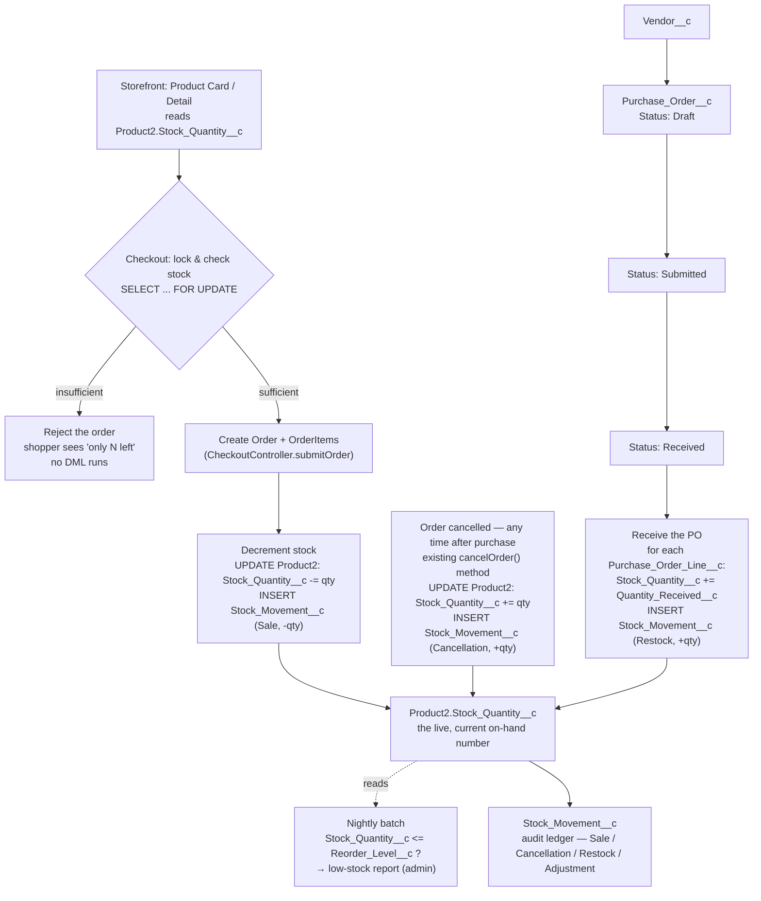

# LaptopKart — Inventory & Vendor System Plan

**Status: plan only — nothing in this document has been built yet.**

A visual version of this same plan (styled diagram + tables) is published at:
https://claude.ai/artifact/QDWdKpJWf4qsueiiL7Gucr

## The core idea

One live number per product (`Stock_Quantity__c`) that four events can change — a sale, a cancellation, a received Purchase Order, or a manual adjustment — and one ledger (`Stock_Movement__c`) that logs every one of those changes as a row. Same pattern `Payment__c` already uses for money: a live field on the parent record, plus a child object that's the actual audit trail.

## Flow

Both write paths (checkout decrement, order cancellation) and the vendor-driven restock subflow converge on the same `Stock_Quantity__c` field and the same `Stock_Movement__c` ledger — one number to read, one ledger to audit, no matter which of the four events caused the change.

## Object reference

### `Vendor__c` — new object

One record per supplier. Plain custom object — a real Salesforce "Vendor" concept doesn't exist, and reusing `Account` would mix suppliers into the same object as customers.

| Field (API Name) | Label | Type | Notes |
|---|---|---|---|
| `Name` | Vendor Name | Text(80) | Standard primary Name field, required |
| `Contact_Name__c` | Contact Name | Text(120) | Primary contact person at the vendor |
| `Email__c` | Email | Email | |
| `Phone__c` | Phone | Phone | |
| `Address__c` | Address | Address (compound) | Street/City/State/Postal/Country as one field |
| `Status__c` | Status | Picklist | Active, Inactive — restricted, default Active |
| `Payment_Terms__c` | Payment Terms | Picklist | Net 15, Net 30, Net 45, COD — optional |
| `Notes__c` | Notes | Long Text Area(2000) | Optional free text |

### `Product2` — new fields on the standard object

No new object — five fields added to the standard `Product2` the catalog already runs on.

| Field (API Name) | Label | Type | Notes |
|---|---|---|---|
| `Stock_Quantity__c` | Stock Quantity | Number(18,0) | Current on-hand quantity — the "live number." Default 0. |
| `Reorder_Level__c` | Reorder Level | Number(18,0) | Threshold the nightly batch compares stock against |
| `Reorder_Quantity__c` | Reorder Quantity | Number(18,0) | Optional — pre-fills a new PO line when restocking |
| `Primary_Vendor__c` | Primary Vendor | Lookup(Vendor__c) | Who to reorder from — single-vendor model |
| `SKU_At_Vendor__c` | Vendor SKU | Text(60) | Optional — the vendor's own product code |

### `Stock_Movement__c` — new object

The audit ledger. Every write to `Stock_Quantity__c`, from any of the four events, inserts exactly one row here.

| Field (API Name) | Label | Type | Notes |
|---|---|---|---|
| `Name` | Movement Number | Auto Number | Format `SM-{0000}` |
| `Product__c` | Product | Lookup(Product2) | Required |
| `Movement_Type__c` | Movement Type | Picklist | Sale, Cancellation, Restock, Adjustment — restricted, required |
| `Quantity__c` | Quantity | Number(18,0) | Signed — negative for Sale, positive for Restock/Cancellation |
| `Running_Balance__c` | Balance After | Number(18,0) | Optional — snapshot of Stock_Quantity__c right after this row |
| `Related_Order__c` | Related Order | Lookup(Order) | Set for Sale / Cancellation movements |
| `Related_Purchase_Order__c` | Related Purchase Order | Lookup(Purchase_Order__c) | Set for Restock movements |
| `Movement_Date__c` | Movement Date | Date/Time | Defaults to now |
| `Notes__c` | Notes | Text Area(255) | Free text — e.g. reason for a manual Adjustment |

### `Purchase_Order__c` — later phase

One formal order placed with a vendor. Only needed once manual stock edits feel too loose.

| Field (API Name) | Label | Type | Notes |
|---|---|---|---|
| `Name` | PO Number | Auto Number | Format `PO-{0000}` |
| `Vendor__c` | Vendor | Lookup(Vendor__c) | Required |
| `Status__c` | Status | Picklist | Draft, Submitted, Received, Cancelled — restricted |
| `Order_Date__c` | Order Date | Date | |
| `Expected_Delivery_Date__c` | Expected Delivery | Date | |
| `Received_Date__c` | Received Date | Date | Populated when Status__c → Received |
| `Total_Amount__c` | Total Amount | Currency(16,2) | Roll-up sum of its lines' cost |

### `Purchase_Order_Line__c` — later phase, child of `Purchase_Order__c`

One row per product on a Purchase Order — master-detail so it's deleted along with its parent PO.

| Field (API Name) | Label | Type | Notes |
|---|---|---|---|
| `Purchase_Order__c` | Purchase Order | Master-Detail(Purchase_Order__c) | Required |
| `Product__c` | Product | Lookup(Product2) | Required |
| `Quantity_Ordered__c` | Quantity Ordered | Number(18,0) | Required |
| `Unit_Cost__c` | Unit Cost | Currency(16,2) | What the vendor charges per unit |
| `Quantity_Received__c` | Quantity Received | Number(18,0) | Defaults 0, updated on receiving — drives the Restock movement |

### Alternative: `Vendor_Product__c` junction object

If one product ever needs more than one vendor, replace `Product2.Primary_Vendor__c` with this junction object instead:

| Field (API Name) | Type |
|---|---|
| `Product__c` | Lookup(Product2) |
| `Vendor__c` | Lookup(Vendor__c) |
| `Vendor_SKU__c` | Text |
| `Cost_Price__c` | Currency |
| `Lead_Time_Days__c` | Number |
| `Is_Preferred__c` | Checkbox — marks which vendor a PO defaults to |

Only build this version if it's genuinely true for the catalog — see "Two calls only you can make" below.

## Build order

1. **`Vendor__c`** *(schema)* — 8 fields, above. One record per supplier.
2. **Fields on `Product2`** *(schema)* — 5 fields, above.
3. **`Stock_Movement__c`** *(schema)* — 9 fields, above. The ledger every other step writes to.
4. **`InventoryService.cls`** *(logic)* — mirrors the existing `PaymentService` pattern. One method to lock-and-check stock (`FOR UPDATE`), one to decrement + log, one to restore + log — called from `CheckoutController.submitOrder` and `cancelOrder`.
5. **Storefront LWC updates** *(logic)* — product card, product detail, and the quantity stepper read `Stock_Quantity__c` — "only N left" / disabled Buy Now at zero, stepper capped at what's in stock.
6. **Admin restock path** *(logic)* — simplest version: admin edits `Stock_Quantity__c` directly on the Product record, which still fires the Adjustment-movement logging.
7. **`Purchase_Order__c` + `Purchase_Order_Line__c`** *(later)* — 11 fields total, above. A formal Draft → Submitted → Received workflow per vendor.
8. **Low-stock batch + dashboard** *(later)* — scheduled Apex (same shape as `OrderPaymentReconciliationBatch`) plus a List View or custom LWC dashboard once the data model has proven itself.

## Two calls only you can make

- **One vendor per product, or many?** `Primary_Vendor__c` is enough if each product has one main supplier; the `Vendor_Product__c` junction object is only worth the extra complexity if products genuinely come from more than one vendor at different costs.
- **Purchase Orders from day one, or later?** Manual stock edits get you a working system fast — the formal PO workflow is a real addition, not a prerequisite, and can be built once the basics are proven out.
